<h1 align="center">blackglass</h1>

<p align="center">
  <strong>Your second brain, in the terminal. Free, open source, and fast.</strong>
</p>

<p align="center">
  <a href="https://github.com/serkanberksoy/blackglass/releases/latest"></a>
  <a href="LICENSE"></a>
  
  
</p>

**blackglass** is a note-taking workspace for people who live in the
terminal: developers, sysadmins, writers on a server, anyone who'd rather
not leave the keyboard. Point it at a folder of Markdown files and you
get a linked knowledge base with live preview, backlinks, tags, search,
queries over your notes, tasks, kanban boards and templates, all in one
15 MB program. It exists because a second brain shouldn't need a
browser engine, an account or a subscription: your notes stay plain
Markdown files, and blackglass opens a 5,000-note vault in about a
tenth of a second.

<p align="center">
  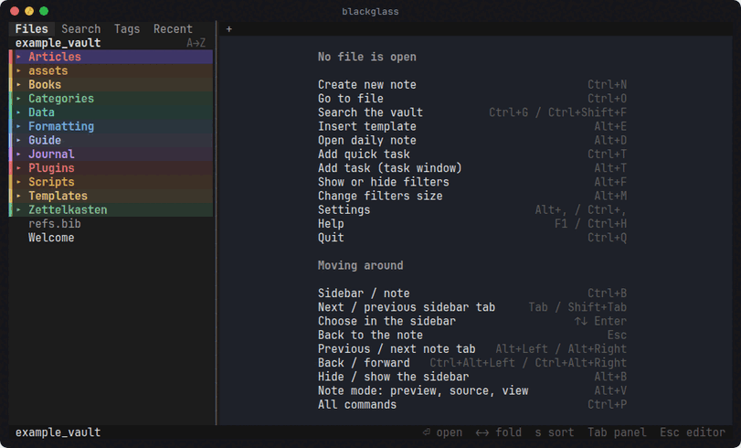
</p>

<p align="center"><em>Go to a note by typing part of its name, add a task with an estimate and a date in words, and watch the query results add it up.</em></p>

**Version:** 1.10.0 · [Version history](VERSION.md) · [Every feature](documentation/features.md)

## Contents

- [Why blackglass](#why-blackglass)
- [Features](#features)
- [Installation](#installation)
- [Quick start](#quick-start)
- [Configuration](#configuration)
- [Keyboard shortcuts](#keyboard-shortcuts)
- [How it's built](#how-its-built)
- [Development](#development)
- [Support the project](#support-the-project)

## Why blackglass

- **Free, forever.** MIT licensed, no account, no subscription, no cloud.
  It never phones home; it only goes online when you ask it to (a Git
  sync, a web request in a template).
- **Your notes stay yours.** Plain Markdown files in a folder you choose.
  Open them in any editor, sync them with anything, keep them in Git.
  Nothing is locked in a database.
- **Fast, really.** Written in Rust. On a vault of 5,000 notes it opens
  in about a tenth of a second, answers a keystroke (redrawn screen
  included) in about 1 ms (3 ms in a 10,000-line note), and searches
  every note in 14 ms. One 15 MB
  program, no runtime, no browser engine.
- **Anywhere you have a shell.** Over SSH on a server, in a tmux pane, on
  a laptop with no window manager. The keyboard drives everything (every
  command can have your own keys), and the mouse works too.
- **Plugins included, not hunted for.** Queries, templates, tasks,
  database views, Git backup, diagrams, tables and more are built in, and
  switched on when you want them.

## Features

125 of 146 tracked features are done; [the full list](documentation/features.md)
says what each one does.

### Linked notes with live preview

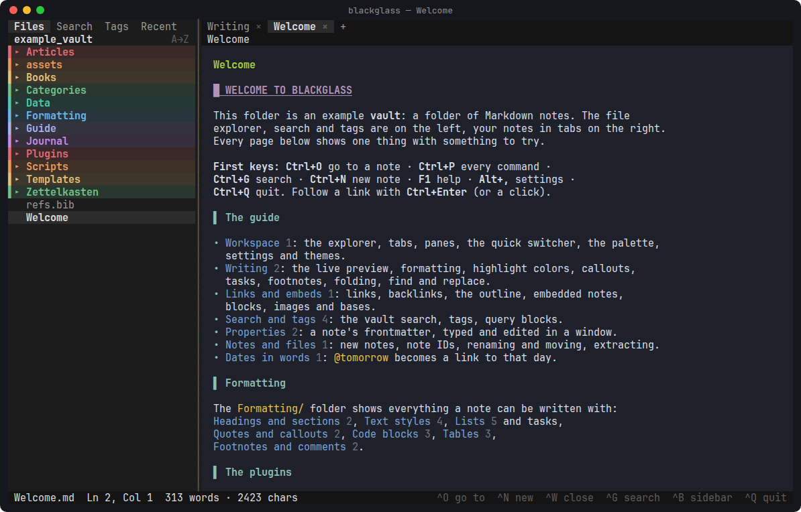

- **Live preview:** headings, tables, callouts, tasks, highlights, images,
  math (`$e = mc^2$` as e = mc²) and embeds rendered as you type, the Markdown right there on the line
  you're editing. Source and read-only view modes too (Alt+V).
- **Links that find notes anywhere:** `[[Note]]`, `[[Note#Heading]]`,
  `[[Note#^block]]`, suggested as you type; backlinks and unlinked
  mentions; renaming a note updates every link to it.
- **Find anything:** a quick switcher (Ctrl+O), vault-wide search with
  operators (`tag:`, `path:`, `"phrases"`, `-not`), nested tags,
  properties typed and edited in a window, bookmarks, an outline.
- **Daily notes and a calendar**, dates in words (`@next friday`), note
  IDs, Folgezettel sequences and literature notes from your Zotero
  library for a full Zettelkasten.

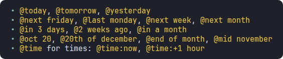

### Queries over your notes

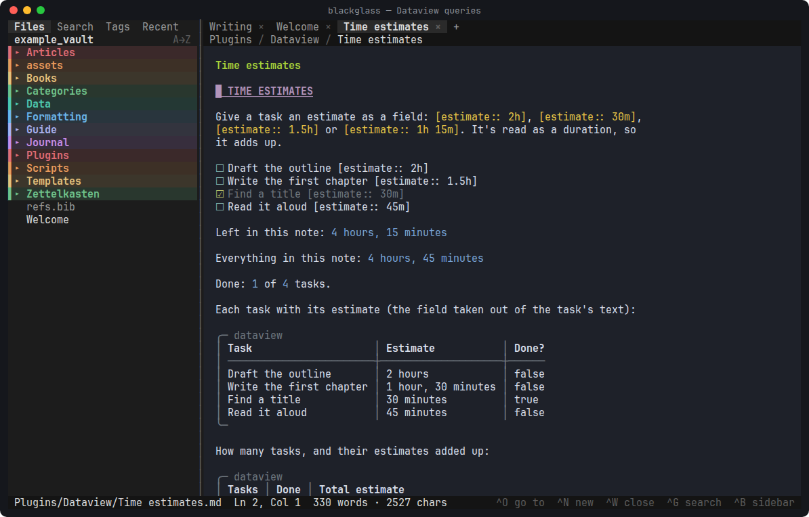

- **Dataview:** `LIST`, `TABLE`, `TASK` and `CALENDAR` queries over
  properties, inline fields, tags, links and tasks, with grouping,
  flattening and functions; inline queries like `` `= sum(this.file.tasks.estimate)` ``.
- **DataviewJS and Templater** run JavaScript in a sandbox (no files, no
  network) for charts, stats and templates that ask questions.
- Results update as you type; click a result to open it or check a task
  off.
- **Worked examples,** built from notes and Dataview queries alone
  (`blackglass --example`): an envelope budget kept in the daily notes,
  with monthly reports (`Budget`), a reading tracker (`Reading tracker`), a habit tracker with
  streaks (`Habits`) and a contacts list with birthdays and who's due a
  call (`Contacts`).

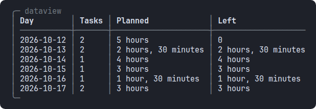

### Tasks, boards and databases

- **Tasks:** due, scheduled and start dates, priorities, recurrence,
  dependencies, estimates; `tasks` queries across the vault; a window
  with every field (Alt+T) and a quick task into today's note (Ctrl+T);
  a task checked in a query's results stays a moment, to click again.
- **QuickAdd:** a command asks a few questions and adds the line to
  today's note, or a note you choose, under a heading (an expense, a
  habit, an idea); or makes a new note from a template.

<p>
  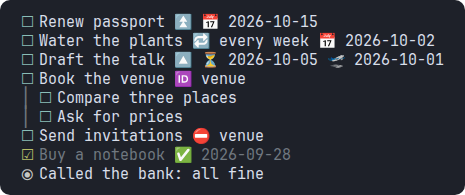
  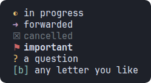
</p>

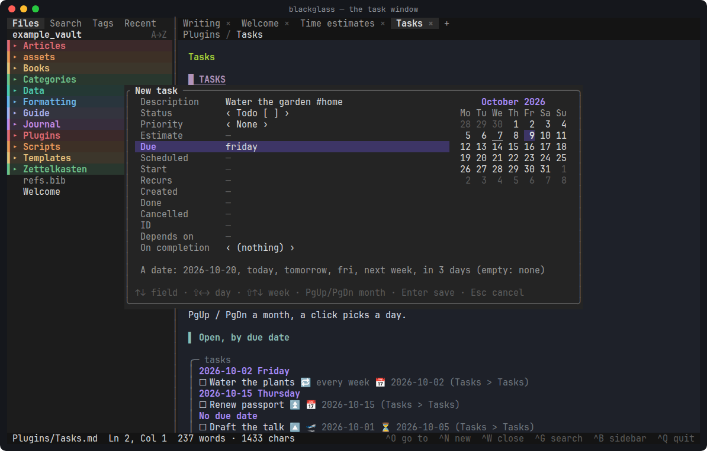

- **Bases:** database views of your notes as tables, cards, lists or
  kanban boards; move a card and the note's property changes.

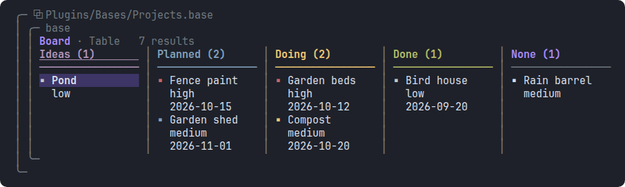

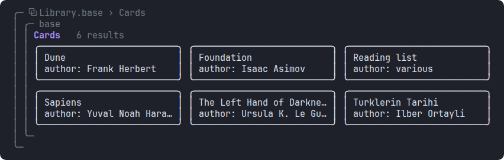

- **Mermaid diagrams drawn as text** (flowcharts, sequence diagrams, pie
  charts, Gantt charts), advanced tables with spreadsheet formulas
  (`=SUM(B2:B4)`), a task archiver, encrypted text, emoji shortcodes, Git
  backup and sync.

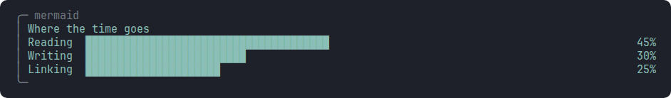

### Every command one keystroke away

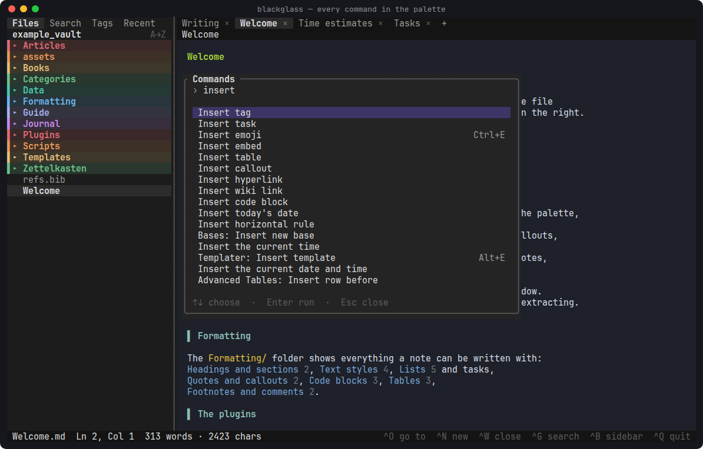

Ctrl+P lists every command (the workspace's, the editor's and the
plugins'), and every one can have your own keys in Settings → Keyboard
shortcuts. A settings window with search, and a built-in help page (F1)
with the keys as they are now.

### Themes

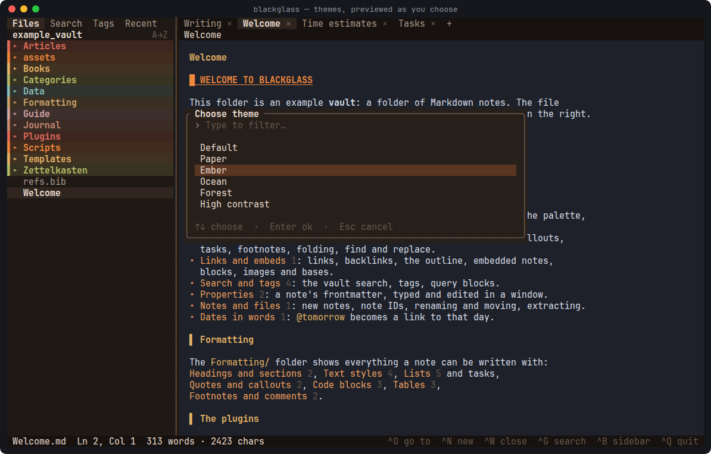

Six themes (Default, Paper for light terminals, Ember, Ocean, Forest and
High contrast), previewed as you move through the list, and your own in
`~/.config/blackglass/themes/`. Colors are fitted to 256- and 16-color
terminals, with ASCII symbols where Unicode can't be shown.

## Installation

### macOS (Homebrew)

1. Install [Homebrew](https://brew.sh) if you don't have it yet:

   ```bash
   /bin/bash -c "$(curl -fsSL https://raw.githubusercontent.com/Homebrew/install/HEAD/install.sh)"
   ```

2. Install blackglass:

   ```bash
   brew install serkanberksoy/tap/blackglass
   ```

   Homebrew builds it from source, with Rust brought in just for the
   build, so the first install takes a few minutes. It works on Apple
   Silicon and Intel Macs.

3. Take the tour, then open your own notes:

   ```bash
   blackglass --example            # the example vault, at ~/blackglass-example
   blackglass ~/Notes              # any folder of Markdown files
   ```

Update with `brew upgrade blackglass`. The same commands work with
Homebrew on Linux. A terminal with true color looks best, such as
iTerm2, WezTerm, kitty or Ghostty.

### Linux (x86_64)

Download `blackglass` from the
[latest release](https://github.com/serkanberksoy/blackglass/releases/latest),
make it executable and put it on your `PATH`. It's one static program,
so it runs on any distribution:

```bash
curl -LO https://github.com/serkanberksoy/blackglass/releases/latest/download/blackglass
chmod +x blackglass
sudo mv blackglass /usr/local/bin/        # or ~/.local/bin
```

### From source (Linux, macOS)

blackglass builds with Rust **1.88 or newer** ([rustup](https://rustup.rs)).
Its editor, [mdedit](https://github.com/serkanberksoy/mdedit), is a
separate repository checked out next to it:

```bash
mkdir notes-tools && cd notes-tools
git clone https://github.com/serkanberksoy/mdedit.git
git clone https://github.com/serkanberksoy/blackglass.git
cd blackglass
cargo install --path .             # into ~/.cargo/bin
```

### Requirements

Any terminal on Linux or macOS; one with true color and a Nerd Font (or
another font with box drawing and emoji) looks best, and plain ASCII
works too. Some terminals keep keys or mouse buttons for themselves:
[documentation/terminals.md](documentation/terminals.md) says what works
where. Optional programs it uses when they're there:

| Program | For |
|---------|-----|
| `wl-paste` / `xclip` / `xsel` (Linux) | The clipboard (paste, copied links) |
| `xdg-open` / `open` | Web links, images and PDFs in their own programs |
| `git` | The Git plugin |
| `curl` | Templater's `tp.web` (a daily quote, web requests) |

## Quick start

```bash
blackglass --example            # try the example vault: a tour of every feature
blackglass ~/Notes              # open your own folder of notes
blackglass                      # choose a vault (the very first time: the example vault)
blackglass ~/Notes/today.md     # open a note in its vault
blackglass --help               # all options and keys
```

The first keys: **Ctrl+P** every command · **Ctrl+O** go to a note ·
**Ctrl+N** new note · **Ctrl+G** search · **Ctrl+B** sidebar / note ·
**F1** help · **Ctrl+Q** quit. Follow a link with **Ctrl+Enter** or a
click.

The example vault is built in: `blackglass --example` writes it to
`~/blackglass-example` (or the folder you give) and opens it. It's a
guided tour: `Welcome.md` leads to a page for each part of the
workspace, each kind of formatting and each plugin, with something to
try on every page.

## Configuration

Everything is set in the settings window (**Alt+,**): the editor, notes,
keyboard shortcuts, themes, and each plugin's page. Settings are saved
in your config folder, `~/.config/blackglass/` (or
`$XDG_CONFIG_HOME/blackglass/`):

- `config.toml`: the editor's settings, which are mdedit's (`auto_pair`,
  `undo_steps`, `images`, `colors`, `glyphs` …; see `mdedit --help`).
  Until blackglass has its own, it reads mdedit's
  `~/.config/mdedit/config.toml`.
- `keys.toml`: the keyboard shortcuts you changed, as
  `command-id = "Keys"` (`new-note = "Alt+N"`; several with ` / `, `""`
  for none).
- `themes/`: your own themes (the keys are described in
  `themes/default.toml`).

A plugin's settings belong to the vault (`.blackglass/plugins/<id>/`),
as do the Notes page's (note IDs, `.blackglass/notes.toml`). Plugins are
installed, enabled and disabled on the settings' Plugins page.

## Keyboard shortcuts

These are the defaults: every command's keys can be changed in Settings
(Alt+,), Keyboard shortcuts. The editor's keys (editing, Ctrl+S, Ctrl+F,
Ctrl+Z, Ctrl+V or Ctrl+Shift+V to paste …) are mdedit's; see
`mdedit --help`. blackglass gets each key first:

| Key | Action |
|-----|--------|
| F1 / Ctrl+H | Help: how blackglass works, and every command with its keys (read-only) |
| Alt+, / Ctrl+, | Settings: editor, keyboard shortcuts, plugins |
| Ctrl+P | Command palette: every command (the editor's too, with their keys), "Insert hyperlink" and other inserts, plugin commands, "Open plugins" |
| Ctrl+O | Go to a note (quick switcher); a new name creates the note |
| Ctrl+N | New note, in the folder selected in the file explorer; in its window, **Tab** picks a template for it (Templater plugin) |
| Ctrl+W, Ctrl+X | Close the tab (asks about unsaved changes) |
| Ctrl+X | With text selected: extract it to a new note: the new-note window opens (Tab: from a template); the text moves there and a link to it replaces it; you stay on the new note |
| Alt+Left/Right, Ctrl+PgUp / Ctrl+PgDn | Previous / next tab |
| Alt+1 / Alt+9 | First tab … last tab ("Go to tab 1" … "Go to last tab") |
| Ctrl+Alt+Left/Right | Back / forward through the notes you were on (also the mouse's back / forward buttons, where the terminal passes them on: kitty, WezTerm, foot, xterm; Konsole keeps them to switch its own tabs; see `documentation/terminals.md`) |
| Ctrl+B | Move the focus to the next open pane: the sidebar, the calendar (if shown), the note, the backlinks (if shown) |
| Alt+B | Hide / show the sidebar |
| Alt+V | Cycle the note's mode: live preview → source → view (read-only; Tab to a link or a query result, Enter or a click follows it, Esc edits) |
| Alt+; | Edit the note's properties: Enter edits a value (or switches a checkbox), a adds, r renames, Delete removes |
| Alt+O | The note's outline: its headings, indented by level; type to filter, Enter jumps |
| Alt+P | Preview the note of the link under the cursor in a popup (↑↓ scroll, Enter opens it, Esc closes) |
| F2 | Rename the note (the one chosen in the file explorer, or the open one); every link to it is updated |
| Alt+L | Show the note's links under it (with the focus): backlinks, unlinked mentions (`l` links one) and outgoing links; ↑↓ choose, Enter opens, Esc back / hide them |
| Alt+D | Today's daily note (Periodic Notes plugin) |
| Alt+C | Show the calendar (with the focus) / hide it: ←→↑↓ move, PgUp / PgDn change month, Enter opens the day's note (asks before creating a new one), `w` / `m` the week's / month's, `t` today, Esc back |
| Ctrl+G, Ctrl+Shift+F | Search the vault |
| F5 | Scan the vault again (after changes made elsewhere) |
| Ctrl+Q | Quit (asks about each note with unsaved changes) |
| Tab, Shift+Tab | In the sidebar: next / previous tab (Files, Search, Tags and the plugins' tabs: Recent, Bookmarks, Git …) |
| Enter | In the sidebar: open a note or folder, a search result, or a tag's notes |
| Right, Left | In the file explorer: open / close a folder |
| s | In the file explorer: sort A-Z, Z-A, newest, oldest |
| Ctrl+U | In search: clear the query |
| Space | On the settings' Plugins page: enable / disable the plugin (Enter installs / uninstalls) |
| Esc | Back to the editor |

## How it's built

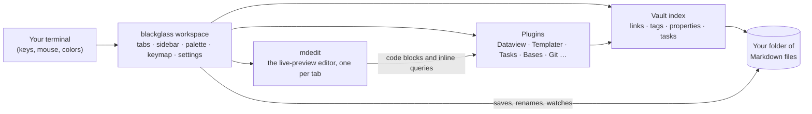

blackglass is written in Rust with [ratatui](https://ratatui.rs). The
editor is [mdedit](https://github.com/serkanberksoy/mdedit), a terminal
Markdown editor embedded as a library; blackglass adds everything that
knows about other notes. JavaScript runs in [Boa](https://boajs.dev), a
JavaScript engine written in Rust, with no access to files or the
network. Work that waits (Git, the web) runs on threads, so the screen
never stalls.

## Development

mdedit must be checked out next to this folder (`../mdedit`). Start with
`CLAUDE.md`; the stack and standards are in
`documentation/technology_and_skills.md`, the plan in
`documentation/project_plan.md`, and every tracked feature (with its
test) in `requirements/features.md`.

```bash
scripts/check.sh                     # the gate: fmt, clippy -D warnings, tests
./run.sh                             # try it: the latest debug build on the example vault
./run.sh Dataview.md                 # … opened at a note (options like --no-mouse pass on)
cargo test --test workspace          # the workspace, driven like a user would
scripts/release-linux.sh             # the static Linux release, packed into dist/
scripts/screenshots.sh               # this README's screenshots and GIF, drawn by blackglass
```

The layout: `src/workspace.rs` (the app: tabs, keys, effects), `src/ui/`
(drawing), `src/vault/` (the vault's index), `src/plugins/<name>/` (one
folder per plugin), `tests/` (the workspace driven by keys and checked
on a drawn screen), `vendor/crossterm` (patched for the mouse's side
buttons), `example_vault/` (a vault to try everything on).

## Support the project

If blackglass is useful to you, please **give it a ⭐ on GitHub**. Stars
help other people who live in the terminal find it, and they tell me the
work is worth continuing. Bug reports, ideas and pull requests are
welcome in the [issues](https://github.com/serkanberksoy/blackglass/issues).

## License

MIT, see [LICENSE](LICENSE).
