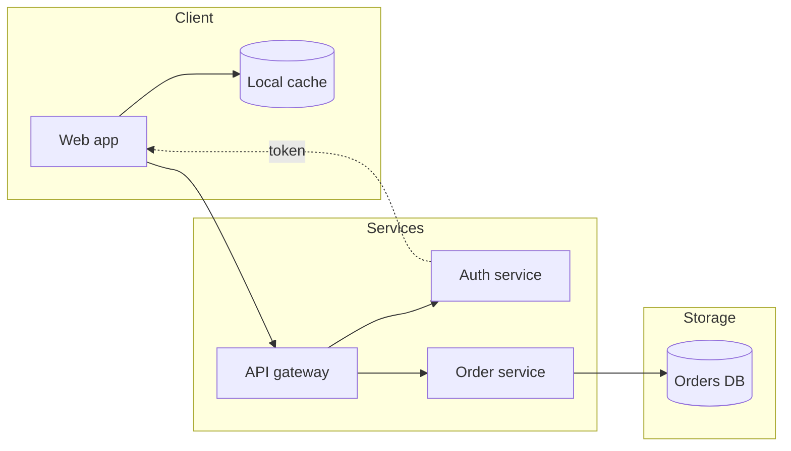
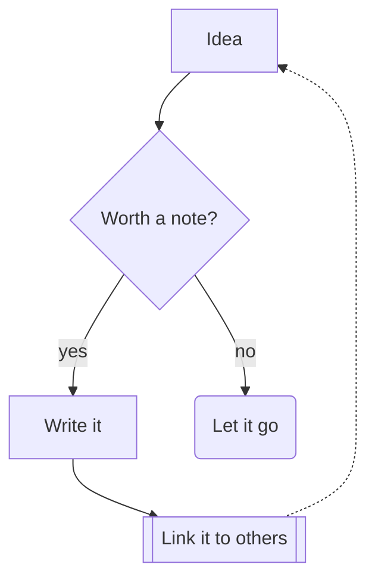
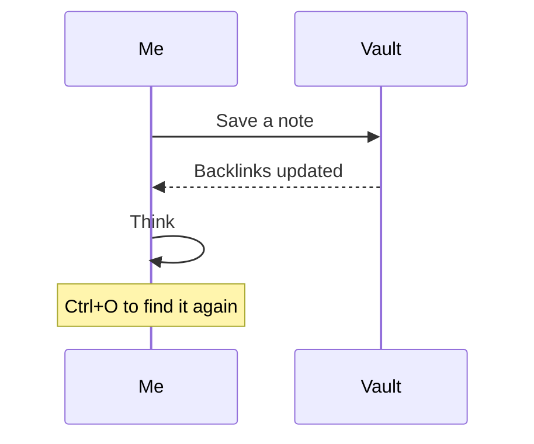
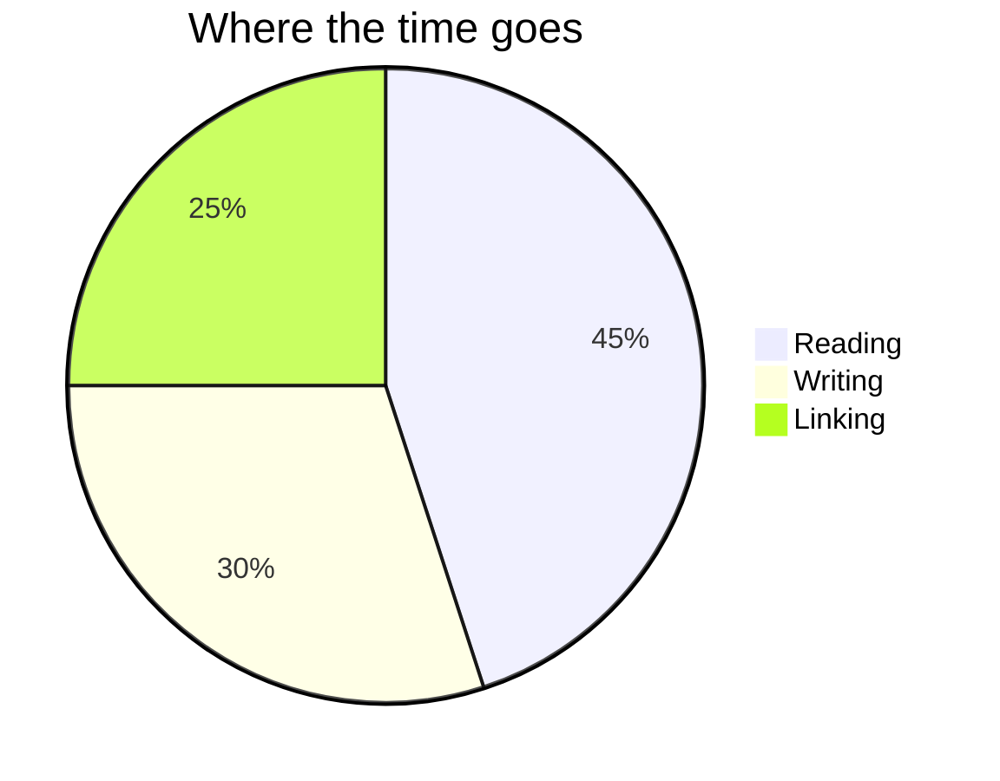
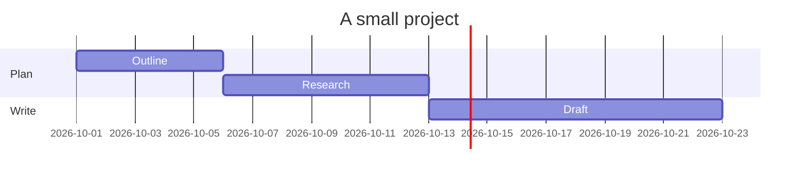
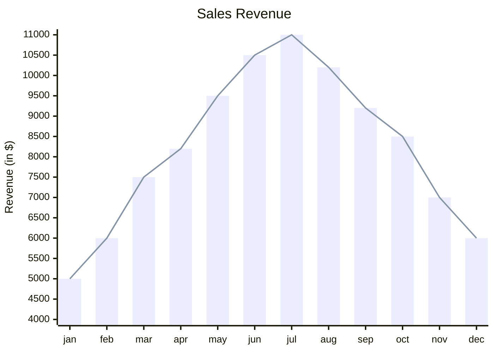

# Diagrams

The Mermaid plugin draws ```` ```mermaid ```` blocks as text.


```mermaid
flowchart LR
  subgraph Client
    UI[Web app]
    Cache[(Local cache)]
  end
  subgraph Services
    API[API gateway]
    Auth[Auth service]
    Orders[Order service]
  end
  subgraph Storage
    DB[(Orders DB)]
  end
  UI --> API
  UI --> Cache
  API --> Auth
  API --> Orders
  Orders --> DB
  Auth -. token .-> UI
```



```mermaid
flowchart TD
  A[Idea] --> B{Worth a note?}
  B -->|yes| C[Write it]
  B -- no --> D(Let it go)
  C --> E[[Link it to others]]
  E -.-> A
```


```mermaid
sequenceDiagram
  participant Me
  participant Vault
  Me->>Vault: Save a note
  Vault-->>Me: Backlinks updated
  Me->>Me: Think
  Note over Me: Ctrl+O to find it again
```


```mermaid
pie title Where the time goes
  "Reading" : 45
  "Writing" : 30
  "Linking" : 25
```


```mermaid
gantt
  title A small project
  dateFormat YYYY-MM-DD
  section Plan
  Outline  :a1, 2026-10-01, 5d
  Research :after a1, 7d
  section Write
  Draft    :2026-10-13, 10d
```



```mermaid
xychart
    title "Sales Revenue"
    x-axis [jan, feb, mar, apr, may, jun, jul, aug, sep, oct, nov, dec]
    y-axis "Revenue (in $)" 4000 --> 11000
    bar [5000, 6000, 7500, 8200, 9500, 10500, 11000, 10200, 9200, 8500, 7000, 6000]
    line [5000, 6000, 7500, 8200, 9500, 10500, 11000, 10200, 9200, 8500, 7000, 6000]
```

